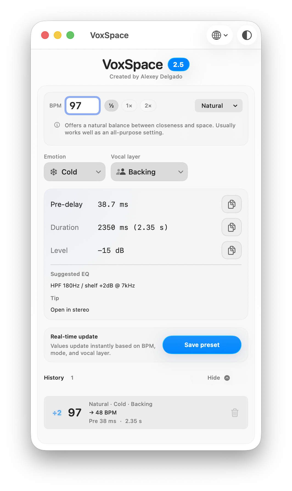

## 🇪🇸 Español

# VoxSpace

👉 Descarga la última versión: https://github.com/alexeydelgado/VoxSpace/releases

Generador de reverb vocal basado en BPM para tomar decisiones rápidas y musicales en mezcla.

---

## Uso rápido

1. Introduce el BPM de tu track  
2. Selecciona modo, emoción y capa vocal  
3. Aplica los valores sugeridos  
4. Ajusta a oído en tu plugin  

VoxSpace proporciona un punto de partida, no una mezcla final.

Pensado para integrarse directamente en tu flujo de mezcla.

---

VoxSpace es una app de macOS creada con SwiftUI para generar rápidamente ajustes de reverb vocal basados en tres ideas simples:

- `Modo`: define el tamaño y la sensación espacial de la reverb
- `Emoción`: define el color o carácter del efecto
- `Capa vocal`: define cuánto protagonismo tiene la voz en la mezcla

El objetivo de la app no es sustituir el oído ni mezclar por ti, sino ofrecer un punto de partida rápido, coherente y musical.
Está diseñada para evitar decisiones a ciegas al usar reverb y acelerar el flujo de trabajo en mezcla.

---

## Captura

---

## Qué hace la app

El usuario introduce un BPM y selecciona:

- un modo espacial
- una emoción
- una capa vocal

VoxSpace calcula en tiempo real:

- Pre-delay
- Duración (decay de la reverb)
- Nivel (cantidad de reverb en dB)
- una sugerencia de EQ
- una recomendación rápida de uso

También permite guardar presets en un historial interno.

---

## Diseño del sistema

La app sigue una jerarquía clara:

1. `Modo`
Define la estructura espacial (distancia y tamaño)
2. `Capa vocal`
Controla cuánto se percibe la reverb
3. `Emoción`
Añade color y matiz sin redefinir el espacio

Esto implica que:

- `Íntima` siempre se percibe más cercana
- `Grande` siempre se percibe más amplia
- la emoción debe matizar, no romper el espacio

---

## Modos

Modos actuales:

- `Modo clásico`
- `Íntima`
- `Natural`
- `Grande`

Cada modo cambia la relación entre tempo, pre-delay y duración para generar una percepción espacial distinta.
`Modo clásico` funciona como referencia base: calcula valores únicamente a partir del BPM, sin aplicar modificaciones contextuales o de carácter.

---

## Emociones

Emociones actuales:

- `Frío`
- `Cálido`
- `Tenso`
- `Vacío`

No representan espacios distintos, sino diferentes colores dentro del mismo espacio.
Influyen principalmente en cómo se percibe la cola de la reverb (más corta, más difusa, más controlada) y en la EQ sugerida.

---

## Capas vocales

- `Principal`
- `Coros`
- `Adlibs`
- `Textura`

Ajustan la cantidad de reverb en función del rol de la voz dentro de la mezcla.

---

## Filosofía

VoxSpace está diseñada para trabajar rápido.

1. Elegir un contexto musical
2. Obtener un punto de partida inmediato
3. Ajustar a oído en el plugin o cadena real

Es una herramienta de toma de decisiones, no un sustituto de la mezcla final.

---

## Interfaz

La app está estructurada como una ventana compacta con:

- cabecera
- bloque principal de entrada
- bloque de resultados
- guardado de presets
- historial

---

## Persistencia

La app recuerda:

- el idioma seleccionado
- el último BPM
- el modo, emoción y capa activos
- el estado del historial

---

## Idiomas

- Español
- Inglés

---

## Estructura del proyecto

- `ContentView.swift` → UI + lógica
- `VoxSpaceApp.swift` → punto de entrada
- `Assets.xcassets` → recursos

---

## Estado

VoxSpace ya es utilizable en flujos de trabajo reales, pero sigue en desarrollo activo.

- cálculo en tiempo real
- historial persistente
- interfaz en evolución y ajuste continuo

Algunos comportamientos (especialmente interacciones de UI y ciertos casos límite) siguen en proceso de mejora.

---

## Feedback

VoxSpace sigue en desarrollo.

El feedback es clave para mejorar tanto la lógica musical como la experiencia de uso.
Si detectas comportamientos inconsistentes, confusos o mejorables, ese input es especialmente valioso.

---

## Futuro

- más idiomas
- presets favoritos
- funciones de exportación
- ajuste musical más profundo

---

## Autor

Alexey Delgado

## 🇬🇧 English

# VoxSpace

👉 Download the latest version: https://github.com/alexeydelgado/VoxSpace/releases

BPM-based vocal reverb generator for fast, musically coherent mixing decisions.

---

## Quick Use

1. Enter your track BPM  
2. Select mode, emotion, and vocal layer  
3. Apply the suggested values  
4. Refine by ear in your plugin  

VoxSpace provides a starting point, not a final mix.

Designed to integrate directly into your mixing workflow.

---

VoxSpace is a macOS app built with SwiftUI to quickly generate vocal reverb settings based on three simple ideas:

- `Mode`: defines the size and spatial feeling of the reverb
- `Emotion`: defines the color or character of the effect
- `Vocal layer`: defines how prominent the voice is in the mix

The goal of the app is not to replace your ear or mix for you, but to provide a fast, coherent and musical starting point.
It is designed to avoid blind decisions when using reverb and to speed up the mixing workflow.

---

## Screenshot

---

## What the app does

The user enters a BPM and selects:

- a spatial mode
- an emotion
- a vocal layer

VoxSpace then calculates in real time:

- Pre-delay
- Duration (reverb decay)
- Level (reverb amount in dB)
- a suggested EQ
- a quick usage tip

It also allows saving presets in an internal history.

---

## System design

The app follows a clear hierarchy:

1. `Mode`
Defines the spatial structure (distance and size)
2. `Vocal layer`
Controls how much of the reverb is perceived
3. `Emotion`
Adds color and nuance without redefining the space

This means:

- `Intimate` always feels closer
- `Large` always feels wider
- emotion should refine, not break the space

---

## Modes

Current modes:

- `Classic mode`
- `Intimate`
- `Natural`
- `Large`

Each mode changes the relationship between tempo, pre-delay and decay to create a different spatial perception.
`Classic mode` works as a base reference: it calculates values only from BPM, without applying contextual or character-based modifications.

---

## Emotions

Current emotions:

- `Cold`
- `Warm`
- `Tense`
- `Hollow`

They do not represent different spaces, but different tonal characters within the same space.
They mainly affect how the decay is perceived (shorter, more diffuse, more controlled) and the suggested EQ.

---

## Vocal layers

- `Lead`
- `Choir`
- `Adlibs`
- `Texture`

They adjust how much reverb is applied depending on the role of the voice in the mix.

---

## Philosophy

VoxSpace is designed for speed.

1. Choose a musical context
2. Get an immediate starting point
3. Refine by ear in your plugin or chain

It is a decision-making tool, not a final mix solution.

---

## Interface

The app is structured as a compact window with:

- header
- main input section
- results section
- preset saving
- history

---

## Persistence

The app remembers:

- selected language
- last BPM
- current mode, emotion and layer
- history state

---

## Languages

- Spanish
- English

---

## Project structure

- `ContentView.swift` → UI + logic
- `VoxSpaceApp.swift` → entry point
- `Assets.xcassets` → resources

---

## Status

VoxSpace is usable in real workflows, but is still actively in development.

- real-time calculation
- persistent history
- evolving UI and interaction design

The tool is still being refined, and some behaviors (especially UI interactions and edge cases) may continue to improve over time.

---

## Feedback

VoxSpace is still in the works.

Feedback is essential to improve both the musical logic and the user experience.
If you use the app and notice anything unclear, inconsistent, or improvable, that input is extremely valuable.

---

## Future

- more languages
- favorite presets
- export features
- deeper musical tuning

---

## Author

Alexey Delgado